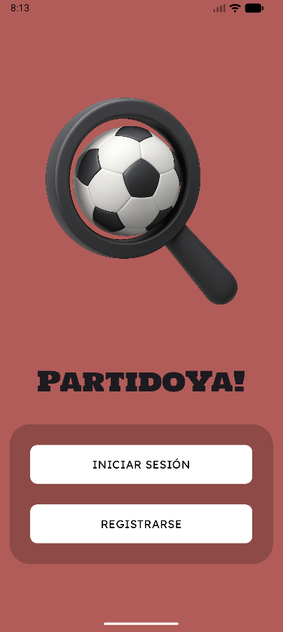
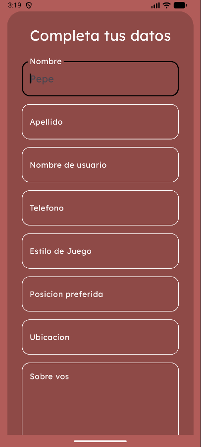
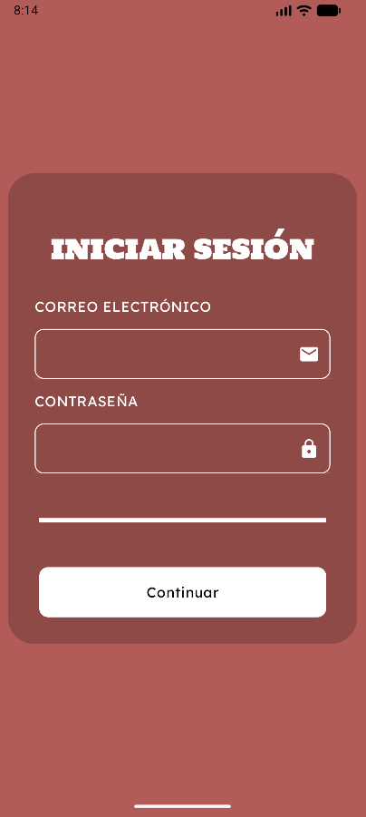
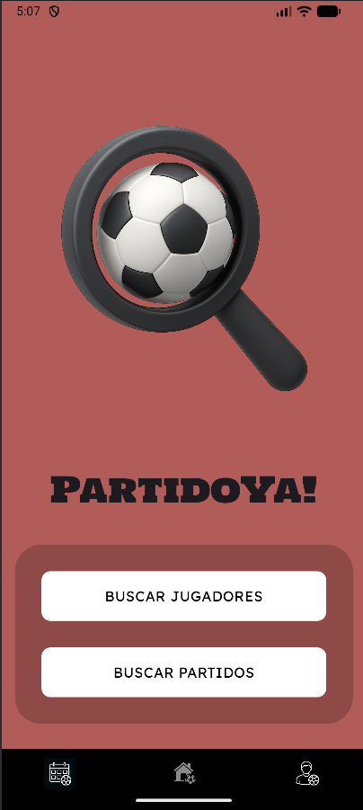
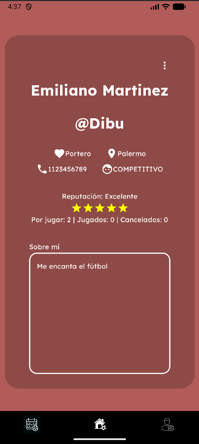
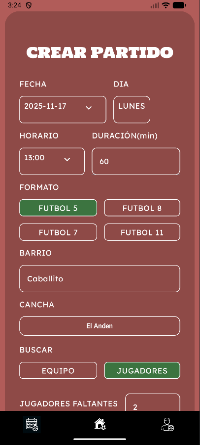
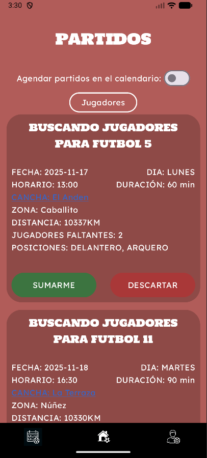
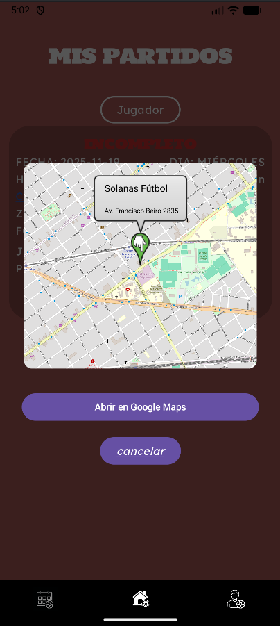
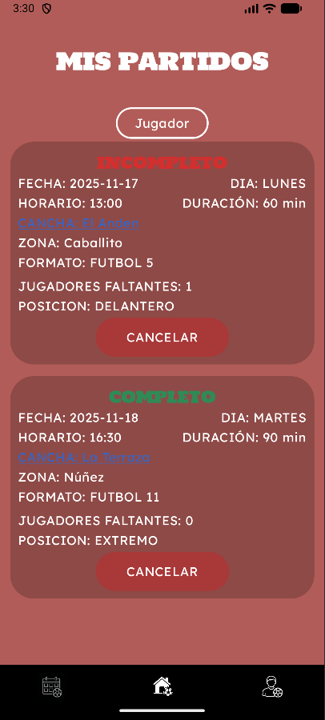
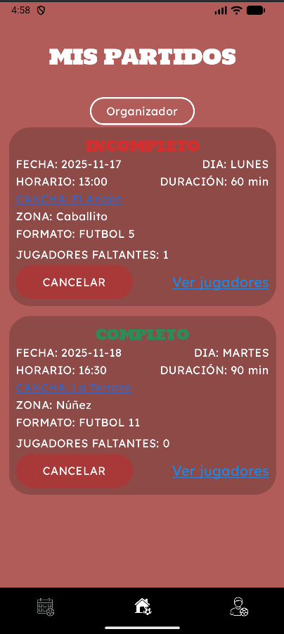

# 🏆 PartidoYa!
PartidoYa! es una aplicación móvil diseñada para ayudarte a **encontrar jugadores**, **organizar partidos de fútbol** y **participar en encuentros cerca de ti**.  
Aquí encontrarás una guía completa para aprender a utilizar la aplicación.

---

## 📱 Pantalla Principal
Al abrir la aplicación, llegarás a una pantalla que te solicita **iniciar sesión**.  
Puedes elegir entre:
- **Crear una cuenta**.
- **Iniciar sesión** con una cuenta existente.
- **Iniciar sesión** usando **Google**.

  

---

## 📝 Registro
Para crear una cuenta, debes:
1. Especificar tu **correo electrónico** y **contraseña** en un primer paso.
2. Luego, completar tu **información de jugador** (nombre, estilo de juego, posición favorita, etc.).
3. ¡Ahora puedes usar **PartidoYa!** para encontrar tu próximo partido!

  
  

---

## 🔐 Inicio de Sesión
Si ya tienes una cuenta, solo necesitas ingresar tu **correo electrónico** y **contraseña** para **acceder a la aplicación**.

  

---

## 🏠 Pantalla Principal (Usuario Conectado)
Una vez **conectado**, llegarás a la **pantalla principal**, donde encontrarás:
- Los botones **"Buscar Jugadores"** y **"Buscar Partidos"**.
- Una **barra de navegación** en la parte inferior que permite acceder a las diferentes secciones de la aplicación.

  

---

## 👤 Perfil del Usuario
El ícono ubicado a la **derecha** de la barra de navegación te lleva a tu **perfil de jugador**.  
Desde el perfil puedes **consultar y editar** tu información personal.

  

---

## ➕ Crear un Partido
La **pantalla principal** (accesible desde el ícono central) ofrece varios botones, incluido **"Buscar Jugadores"**.  
Al presionar este botón, el usuario accede a la **página de creación de partido**.  
Debes indicar la **hora de inicio**, la **duración**, el **tipo del partido** y el **número de jugadores necesarios** (indicando eventualmente su posición).  
El partido se **publica**, y otros usuarios pueden **inscribirse** para participar.

  

---

## 🔎 Buscar un Partido
La **pantalla principal** también permite **buscar entre los partidos ya publicados** mediante el botón **"Buscar Partidos"**.  
Al pulsar este botón, se muestran los partidos existentes, y es posible **inscribirse en uno o varios** de ellos.  
Además, al hacer clic en el **nombre del cancha**, se abre una ventana mostrando la **ubicación exacta** y la opción de **abrir la ruta en Google Maps** para llegar fácilmente.

  
  

---

## 📅 Mis Partidos
El ícono de la **izquierda** te lleva a la sección **"Mis Partidos"**, donde se registran todos los partidos en los que el usuario está inscrito.  
Los partidos se dividen en **2 secciones**:
1. Partidos **creados y publicados** (donde el usuario es **organizador**).
2. Partidos **a los que te has unido** como jugador.

Desde esta pantalla, también es posible **ver la ubicación del cancha en el mapa** o **cancelar tu participación** en un partido.

  
  

---

## 📬 Autores
- **Ciro Fernandez**
- **Gerardo Muñoz**
- **Ramiro Navarro**
- **Théo Parezys**
